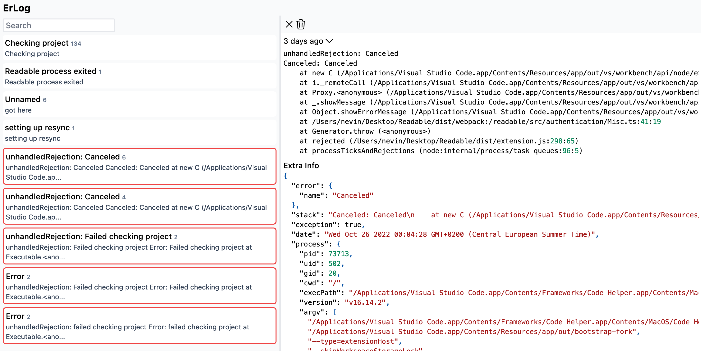

## Erlog

[Roadmap](https://github.com/users/Nevin1901/projects/1)

Erlog is a simple lightweight logging platform. Erlog lets you add logging to your code without worrying about logging.

## Running

`go run -tags json1 main.go` for server - default database is test.db

`yarn start` for ui

docker images coming later

## Rationale

logging sucks. It's expensive, most open source options are not easily self hostable, and for small projects, there's no easy way to implement logs into your applications wihtout using a third party option or self hosting your own logging server.

Erlog lets you log without worrying about logging.

## Features

- Really lightweight (just a go executable and sqlite file)
- Fast. Logs are first stored into memory and then added to sqlite in batches. There are also sqlite tweaks to make writing faster
- Easy to use, just add `const logger = createLogger()` and `logger.log(info)`

## Things that can change

Erlog currently uses sqlite with flags and tweaks which make it really fast. The problem is sqlite can't scale. I'm debating using clickhouse, but at the added complexity of making erlog not be lightweight (4gb ram + dual core if you want to get the most of clickouse)

Also debating using sqlite fts5 tables instead of normal tables for full text search, but I'm not sure that would play nicely with gorm

### Looking for people to help build the commercial version

Will be hosted by us and will be easier for the customer. Dm Nevin#7114 on discord if you want to be a part of it.

Doesn't matter what you do so long as you're dedicated to building a lightweight logging software

## Todo

- benchmark sqlite with gorm and also with sqlite3 go, compilation options
